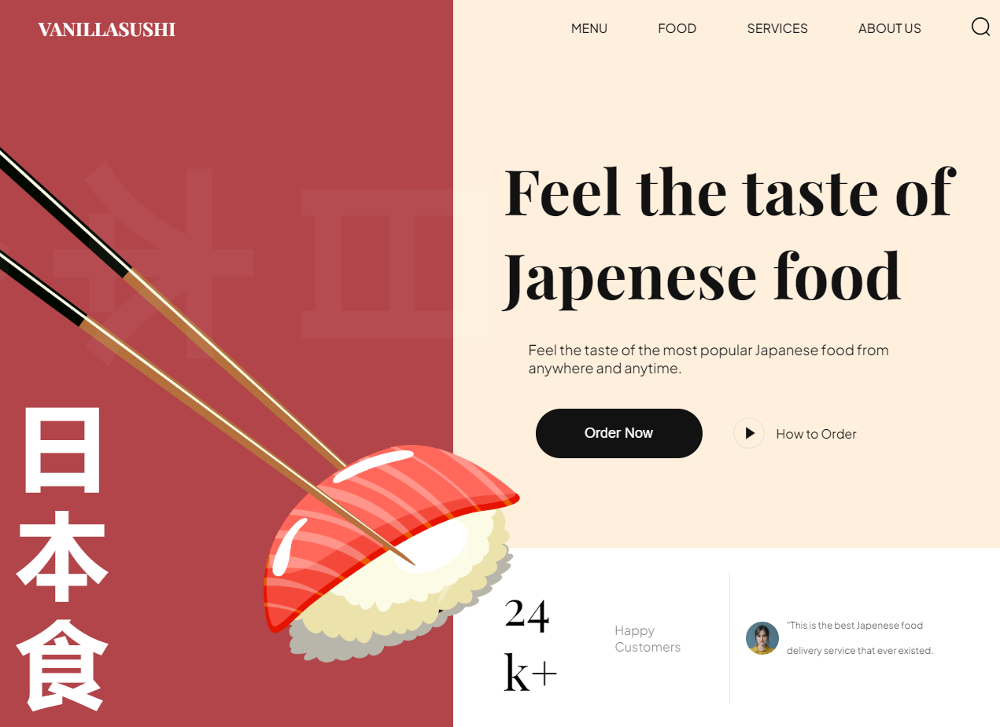

<a name="readme-top"></a>
<div align="center">

  
  

  <h1>Vanilla Sushi Web</h1>
  
  <p>
  Well-designed animated japanese food responsive website - built with Vite.js using Vanilla & JavaScript (Pure HTML,CSS).
  </p>

<!-- Badges -->
<p>
  <a href="https://github.com/ladunjexa/Vanilla-Sushi-Web/graphs/contributors">
    
  </a>
  <a href="">
    
  </a>
  <a href="https://github.com/ladunjexa/Vanilla-Sushi-Web/network/members">
    
  </a>
  <a href="https://github.com/ladunjexa/Vanilla-Sushi-Web/stargazers">
    
  </a>
  <a href="https://github.com/ladunjexa/Vanilla-Sushi-Web/issues/">
    
  </a>
  <a href="https://github.com/ladunjexa/Vanilla-Sushi-Web/blob/master/LICENSE">
    
  </a>
</p>
   
 <h4>
    <a href="https://vanilla-sushi-web.vercel.app/">View Demo</a>
  <span> · </span>
    <a href="https://github.com/ladunjexa/Vanilla-Sushi-Web">Documentation</a>
  <span> · </span>
    <a href="https://github.com/ladunjexa/Vanilla-Sushi-Web/issues/">Report Bug</a>
  <span> · </span>
    <a href="https://github.com/ladunjexa/Vanilla-Sushi-Web/issues/">Request Feature</a>
  </h4>
</div>

<br />

<!-- Table of Contents -->
<details>

<summary>

# :notebook_with_decorative_cover: Table of Contents

</summary>

- [About the Project](#star2-about-the-project)
  * [Folder Structure](#bangbang-folder-structure)
  * [Tech Stack](#space_invader-tech-stack)
- [Getting Started](#toolbox-getting-started)
  * [Installation](#gear-installation)
  * [Run Locally](#running-run-locally)
- [Contributing](#wave-contributing)
- [License](#warning-license)
- [Contact](#handshake-contact)
- [Acknowledgements](#gem-acknowledgements)

</details>  

<!-- About the Project -->
## :star2: About the Project

<div align="center">
  
</div>
<br />

This repository houses an "Vanilla Sushi" Web - amazing animated japanese food responsive website with Vite.js using Vanilla & JavaScript and AOS for animate on scroll - using BEM Methodology 🍣

<!-- Folder Structure -->
### :bangbang: Folder Structure

Here is the folder structure of VanillaSushi.
```bash
Vanila-Sushi-Web/
|- assets/
|- css/
    |-- sections/
        |-- about.css
        |-- footer.css
        |-- header.css
        |-- hero.css
        |-- popular.css
        |-- subscribe.css
        |-- trending.css
    |-- style.css
|- js/
    |-- script.js
|- public/
|- .gitignore
|- index.html
|- package.json
```
<br />

<!-- TechStack -->
### :space_invader: Tech Stack

[](https://skillicons.dev)

<p align="right">(<a href="#readme-top">back to top</a>)</p>

<!-- Getting Started -->
## :toolbox: Getting Started

<!-- Installation -->
### :gear: Installation

#### Step 1:
Download or clone this repo by using the command below:

```bash
 https://github.com/ladunjexa/Vanilla-Sushi-Web.git
```

#### Step 2:

This webapp using NPM (Node Package Manager), therefore, make sure that Node.js is installed by execute the following command in console:

```bash
  node -v
```

#### Step 3:

In root folder execute the following command to get the required packages:

```bash
  npm install
```

<!-- Run Locally -->
### :running: Run Locally

#### Step 1:

Go to root folder and execute the following command in order to run the webapp:

```bash
  npm run dev
```

<p align="right">(<a href="#readme-top">back to top</a>)</p>

<!-- Contributing -->
## :wave: Contributing

<a href="https://github.com/ladunjexa/Vanilla-Sushi-Web/graphs/contributors">
  
</a>


Contributions are always welcome!

See [`contributing.md`](https://contributing.md/) for ways to get started.

Contributions are what make the open source community such an amazing place to learn, inspire, and create. Any contributions you make are **greatly appreciated**.

If you have a suggestion that would make this better, please fork the repo and create a pull request. You can also simply open an issue with the tag "enhancement".
Don't forget to give the project a star! Thanks again!

1. Fork the Project
2. Create your Feature Branch (`git checkout -b feature/AmazingFeature`)
3. Commit your Changes (`git commit -m 'Add some AmazingFeature'`)
4. Push to the Branch (`git push origin feature/AmazingFeature`)
5. Open a Pull Request

<p align="right">(<a href="#readme-top">back to top</a>)</p>

<!-- License -->
## :warning: License

Distributed under the MIT License. See [LICENSE.txt](https://github.com/ladunjexa/Vanilla-Sushi-Web/blob/main/LICENSE) for more information.

<p align="right">(<a href="#readme-top">back to top</a>)</p>

<!-- Contact -->
## :handshake: Contact

Liron Abutbul - [@lironabutbul6](https://twitter.com/lironabutbul6) - [@ladunjexa](https://t.me/ladunjexa)

Project Link: [https://github.com/ladunjexa/Vanilla-Sushi-Web](https://github.com/ladunjexa/Vanilla-Sushi-Web)

<p align="right">(<a href="#readme-top">back to top</a>)</p>

<!-- Acknowledgments -->
## :gem: Acknowledgements

This section used to mention useful resources and libraries that used in CreativAI Webapp:
 - [Vite.js](https://vitejs.dev/)
 - [AOS](https://michalsnik.github.io/aos/)
 - [Google Fonts](https://fonts.google.com/)
 - #JSMastery

<p align="right">(<a href="#readme-top">back to top</a>)</p>
